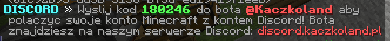
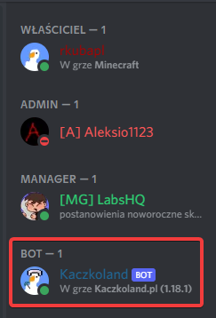
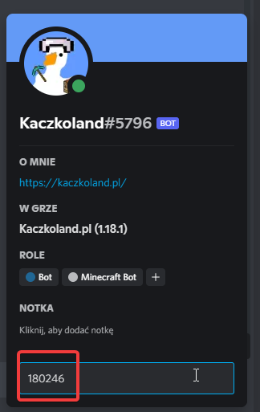
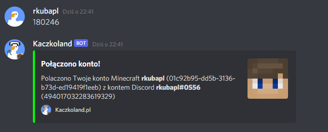
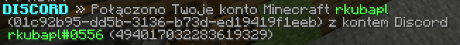
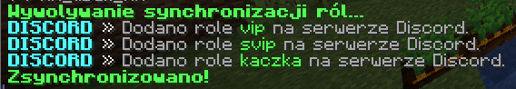

Połączenie Twojego konta Minecraft na serwerze z kontem Discord zsynchronizuje
Twoje rangi na serwerze Minecraft z rangami na serwerze Discord oraz zostanie 
zmieniony Twój nick na serwerze na nick z gry.

## Jak połączyć konta?
1. Dołącz na serwer Discord → [discord.kaczkoland.pl](https://discord.kaczkoland.pl).
2. Na serwerze Minecraft użyj komendy `/discord polacz`.

3. Sześciocyfrowy kod, który otrzymasz na serwerze wyślij do bota **Kaczkoland** 
w prywatnej wiadomości.

4. Po prywatnej weryfikacji otrzymasz w prywatnej wiadomości na Discordzie oraz na
serwerze Minecraft informację, że twoje konta zostały połączone!

!!! warning Nie udało się?
Jeśli nie udało Ci się połączyć kont, spróbuj jeszcze raz od kroku 2. Jeśli
nadal nie uda Ci się połączyć kont, 
napisz do nas na [serwerze Discord](https://discord.kaczkoland.pl)
!!!

## Zsynchronizuj rangi
Użyj komendy `/discord sync` aby zsynchronizować Twoje rangi z serwera Minecraft
na serwerze Discord.

## Odłącz konta
Jeśli chcesz odłączyć konto Minecraft od konta Discord, skontaktuj się z administracją
przez ticketa!
