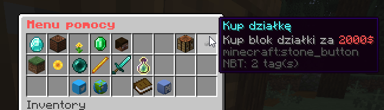
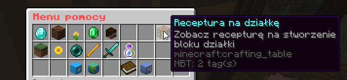
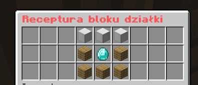
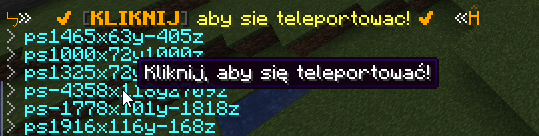
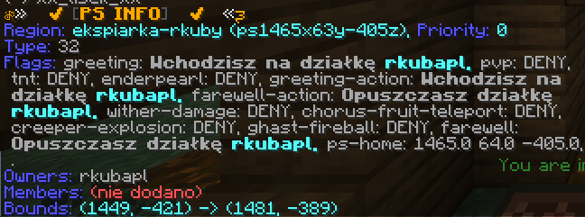
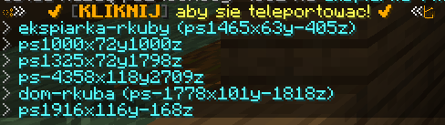
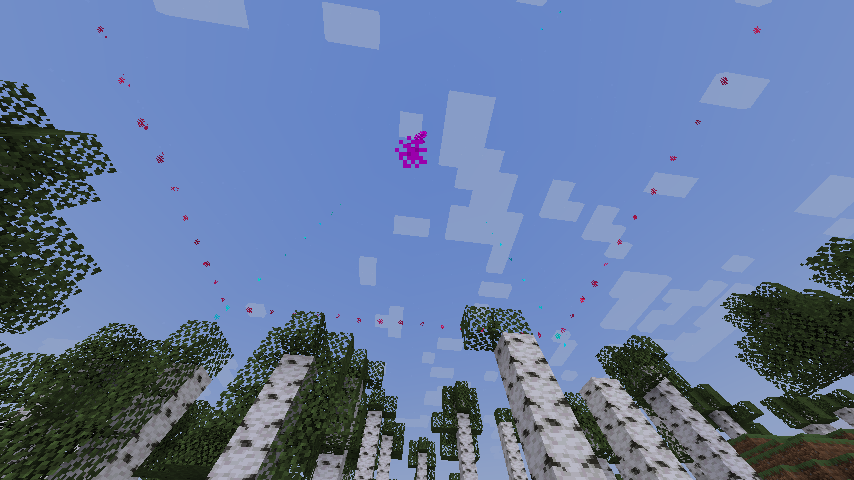

Dzięki działkom możesz ochronić teren przed możliwością modyfikowania go przez 
innych graczy!

## Jak stworzyć działkę?
Aby stworzyć działkę, musisz posiadać blok działki. Każdy gracz na start otrzymuje
jeden taki blok. Jeśli go straciłeś/aś, musisz stworzyc nowy. Zobacz niżej jak.

Jeśli posiadasz blok działki, postaw go w miejscu, gdzie chcesz stworzyć działkę.
Nie może się ona pokładać z innym regionem (z np. spawnem) lub inną działką.

## Jak usunąć działkę?
Jeśli chcesz zmienić miejsce swojej działki, usuń blok działki wykopując go. Blok
działki wróci do Twojego ekwipunku, a teren, który był przez blok chroniony nie jest 
już chroniony!

## Dodawanie/usuwanie gracza do działki
Jeśli chcesz dodać kogoś do działki, użyj komendy `/ps add <nick gracza>`. Dodawaj
do działki osoby, którym jednie ufasz. Dodani gracze mogą stawiać i niszczyć bloki
na działkach, edytować zawartość skrzynek oraz więcej!

Jeśli chcesz kogoś usunąć z działki, użyj komendy `/ps remove <nick gracza>`. Po
użyciu tej komendy gracz straci dostęp do stawiania, niszczenia bloków, skrzynek itd.

## Wyłącz PVP na działce
Jeśli nie chcesz, aby gracze mogli się bić na działce, użyj komendy
`/ps flag pvp deny` stojąc na działce, na której chcesz wyłączyć PVP.

Jeśli zmienisz zdanie, możesz włączyć PVP na działce używając komendy
`/ps flag pvp allow` stojąc na działce, na której chcesz włączyć PVP.
## Blok działki
Blok działki umożliwia stworzenie działki. W zależności od Twojej
[rangi](/ogolne/rangi) masz różny limit działek.
### Kupno
Jednym ze sposobów zdobycia bloku działki jest kupno jej za 2000$ serwerowych.
Możesz ja kupić klikając w guzik w menu `/pomoc` lub używając komendy `/ps get 32`.

### Crafting
Drugim sposobem jest stworzenie bloku działki (scraftowanie go) używajac receptury w 
craftingu/stole rzemieślniczym.
Recepturę możesz zobaczyć w menu `/pomoc` klikając w crafting lub bezpośrednio
`/dzialka-crafting`.

## Inne komendy
### Teleportacja do działki
Aby przeteleportować się do którejś z Twoich działek lub do działki, do której jesteś
dodany/a uzyj komendy `/ps home`, aby zobaczyć listę działek.

Kliknij działkę, do której
chcesz się przeteleportować (aby móc kliknąć w którąś działkę musisz przejść do pisania
klikająć `T` lub `/`).

Domyślnie działka jest nazywana używając lokalizacji bloku działki. Możesz nazwać
działkę, aby łatwiej było Ci rozpoznać która działka to która, więcej informacji niżej.

### Informacje na temat działki
`/ps info` wyświetla informacje na działki, na której aktualnie stoisz 
(dodani gracze, koordynaty itd).

### Nazwywanie działki
`/ps name <nazwa>` umożliwia nazwanie działki, na której stoisz,
przez co przy pokazywaniu
listy działek będzie widoczna też nazwa, dzięki czemu łatwiej będzie Ci się
przeteleportować na właściwą działkę.

### Granica działki
`/ps view` wyświetla granice działki, na której aktualnie stoisz za pomocą
cząsteczek/particli.

