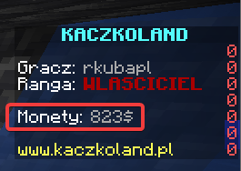
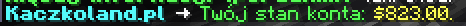
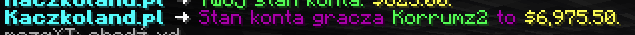
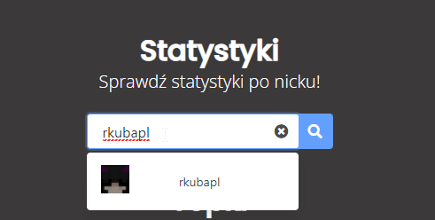
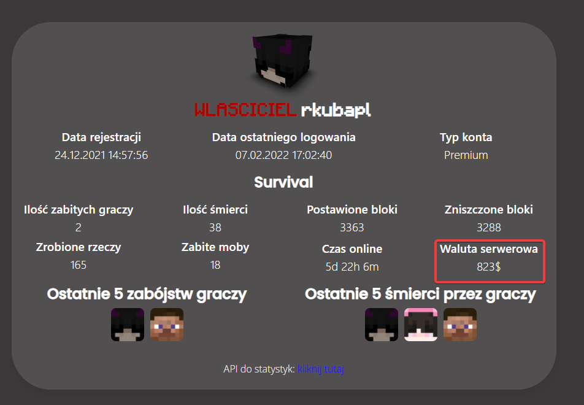
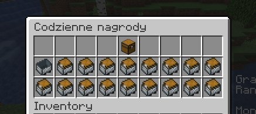
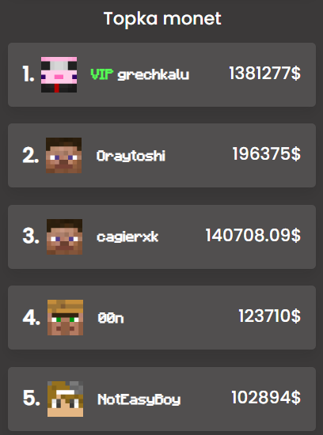

Ekonomia serwerowa działa podobnie do ekonomi w rzeczywistym świecie. Waluta 
serwerowa to dolar ($) i nie jest ona wymienialna na żadną rzeczywistą walutę.

## Jak sprawdzić ile posiadasz monet?
Na scoreboardzie (po prawej stronie obrazu możesz zobaczyć ilość monet.

Możesz również zobaczyć ilość monet używając komendy `/konto`

lub zobaczyć ilość monety innego gracza używając komendy `/konto <nick>`.

Możesz również sprawdzić to na naszej stronie na stronie 
[kaczkoland.pl/statystyki](https://kaczkoland.pl/statystyki).
Wpisz nazwę gracza, którego ilość monet chcesz sprwadzić i kliknij w lupę.

Wyświetli się strona ze statystykami danego gracza oraz z ilością monet.

## Jak zdobywać monety serwerowe?
### Sklep serwerowy
Na spawnie możesz znaleźć sklep serwerowy (możesz do niego przeteleportować się 
używając `/sklep-serwerowy`) gdzie możesz sprzedawać i kupować rzeczy.

Więcej informacji [sklep serwerowy](/survival/sklep-serwerowy)
### Nagrody za codzienną grę
Pod komendą `/odbierz` codziennie możesz odbierać monety oraz rzeczy za codzienne 
wchodzenie i odbieranie nagród!

Więcej informacji na stronie [codzienne nagrody](/survival/codzienne-nagrody).

### Gra na serwerze
Co 30 minut gry na serwerze otrzymujesz 60$ serwerowych.
### Zagłosuj na serwer
Pod komendą `/zaglosuj` możesz głosować na serwer na różnych listach z
serwerami Minecraft. Za zagłosowanie na McList, Serwery-Minecraft, NajSerwery
i Poszukaj.SE codziennie **możesz otrzymać łącznie 400$ serwerowych** (100$ za każde).

Dodatkowo za jednorazowe zagłosowanie na TopkaMC i wysłanie dowodu na 
[serwerze Discord](https://discord.kaczkoland.pl) otrzymasz **400$ serwerowych**.

Więcej informacji na stronie [zagłosuj na serwer](/survival/glosowanie).
### Dom aukcyjny
Dom aukcyjny przypomina Allegro lub OLX, wystawiasz ofertę i ktoś może kupić/wylicytować
wystawioną na sprzedaż rzecz.

Więcej informacji na stronie [o domie aukcyjnym](/survival/dom-aukcyjny).
## Co dają monety serwerowe?
Dzięki nim możesz m.in. [kupić działkę](/survival/dzialki), 
[kupować rzeczy w sklepie serwerowym](/survival/sklep-serwerowy), [kupować rzeczy
w domie aukcyjnym](/survival/dom-aukcyjny).

## Inne komendy
- `/pay <nick gracza> <ilość monet>` - przelewanie wirtualnej waluty na konto innego gracza
- `/baltop` - wyświetlanie graczy z największą ilością monet

## Topka monet
Na naszej stronie [kaczkoland.pl/statystyki](https://kaczkoland.pl/statystyki) możesz
zobaczyć topkę graczy z największa ilością monet.

